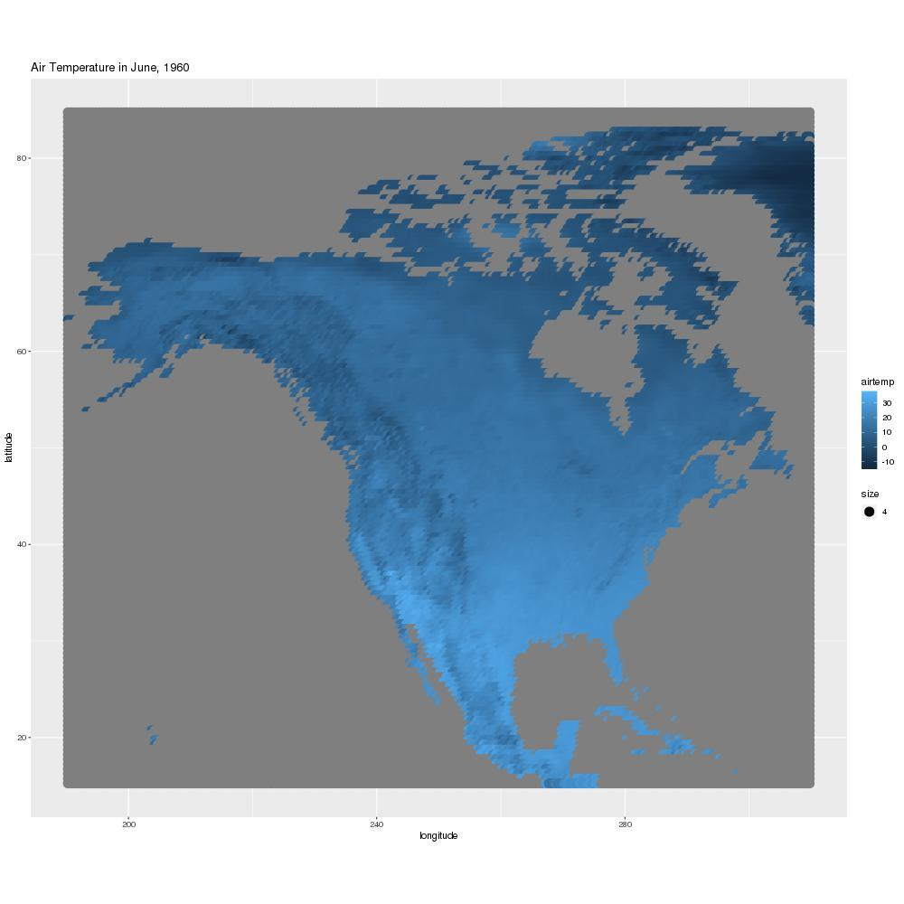
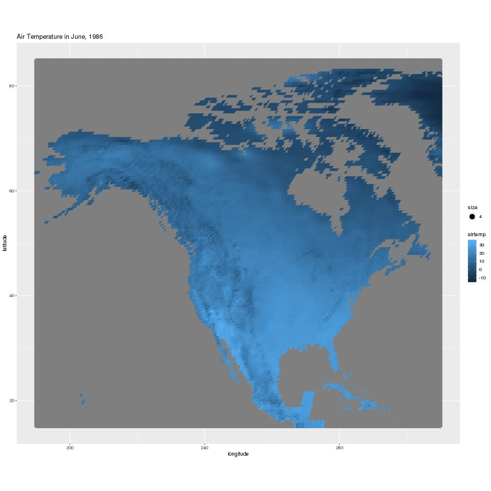
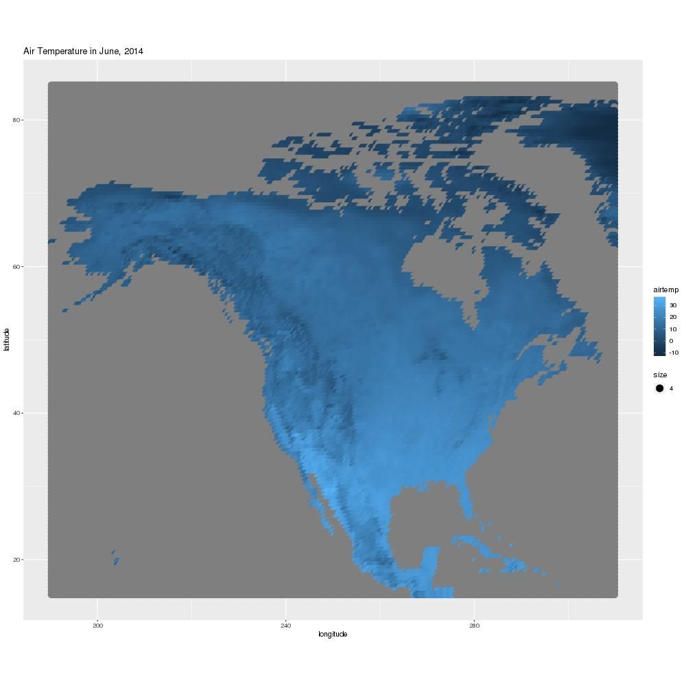
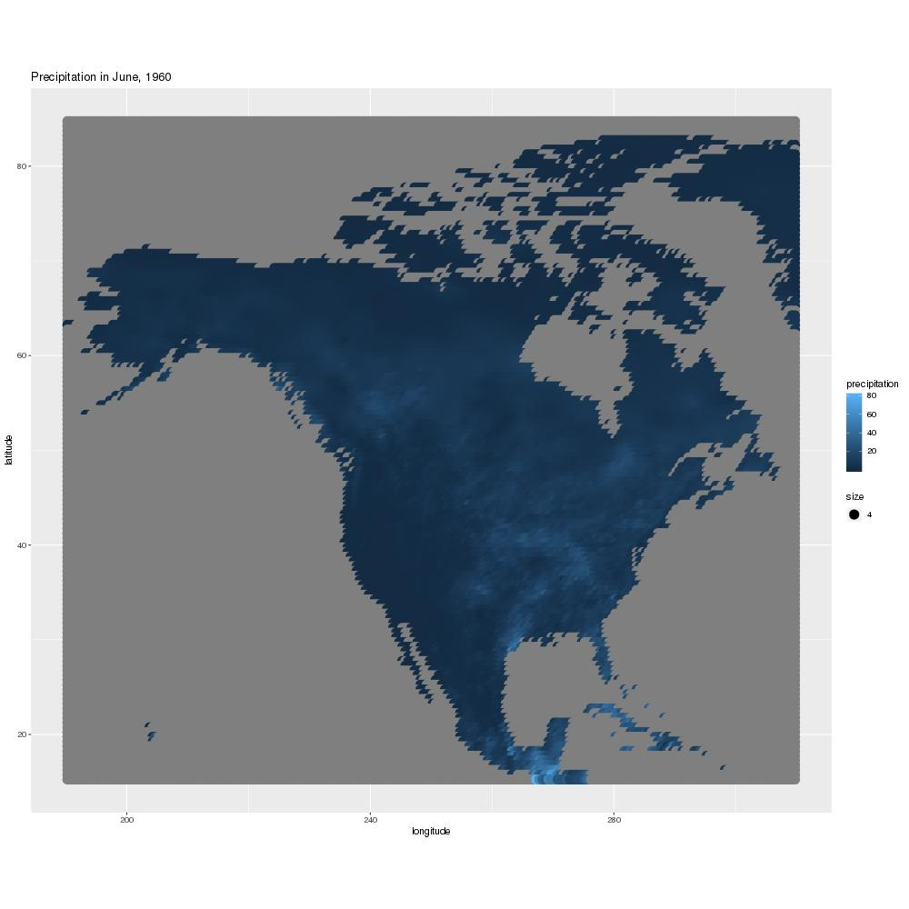
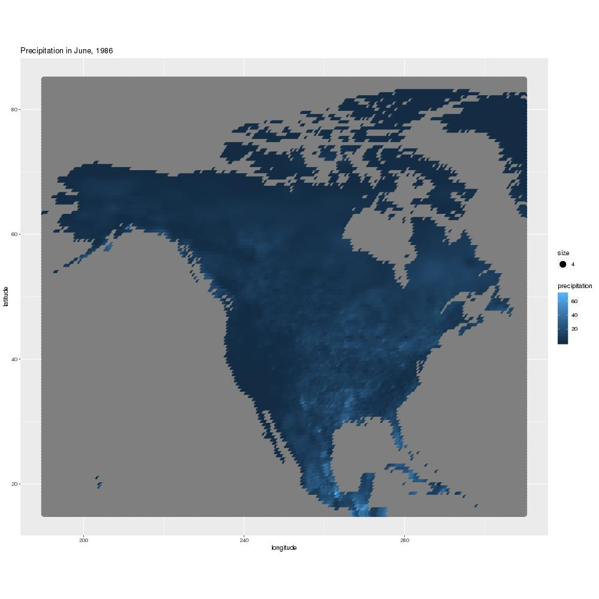
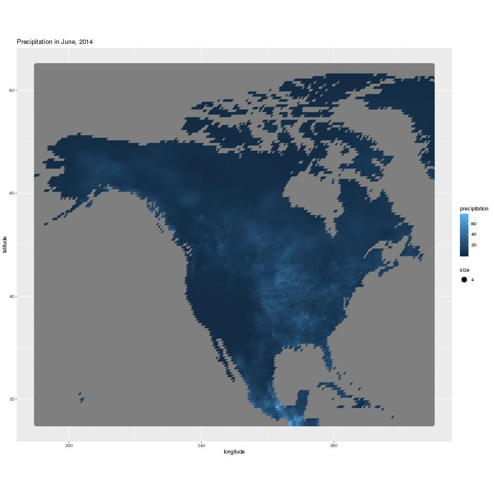

### Data

For this report, we used the middle data set containing temperature and precipitation
data based on latitude and longitude values.

### Temperature
####1960

####1986

####2014

<!-- From 1960 to 1986, there was an increase in total temperature overall in North America, especially from Central Canada down to the U.S.. However this stretch then appears to decrease in air temperature by 2014. The stretch from Alaska down to California, near the mountains, had consistently cold temperatures over the years. There were less differences in air temperature than there was precipitation from 1986 to 2014. These plots looked reasonable as well. -->

### Precipitation
####1960

####1986

####2014

<!-- In 1960 some areas experienced very high amounts of precipitation, especially around Costa Rica and Panama. The max precipitation in 1986 was not as high as it was in 1960, however overall North America experienced more precipitation. The area from quebec to Mexico experienced more precipitation. In 2014, the main precipitation areas shifted towards Central Canada and dwon the middle of the U.S.. Again Panama and Costa Rics experienced high precipitation numbers. The precipitation values seem reasonable and there was quite a bit of difference between years in some areas.-->
